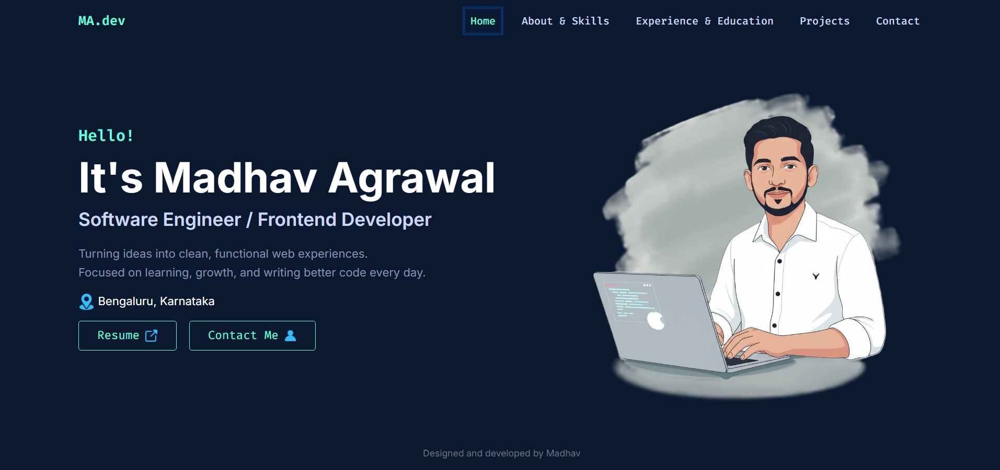

# 👨‍💻 Madhav Agrawal - Personal Portfolio



Welcome to the repository of my personal portfolio website! This responsive single-page application is built to showcase my projects, technical skills, and professional journey as a Software Engineer / Frontend Developer.

## 🚀 Live Demo
**[Insert Your Live Link Here]** *(Example: https://madhav-portfolio.netlify.app)*

---

## 🛠️ Tech Stack

* **Frontend Library:** React.js
* **Build Tool:** Vite
* **Styling:** Bootstrap 5 & Custom CSS
* **Routing:** React Router DOM
* **Icons:** Devicon Icons & SVGs

---

## ✨ Features

* **Responsive Design:** Fully optimized for desktop, tablet, and mobile screens.
* **Project Showcase:** Dynamic grid layout displaying my top projects with links to Code and Live Demos.
* **Dark Navy Theme:** A modern, clean aesthetic using a consistent color palette (`#0a192f` & `#64ffda`).
* **Contact Integration:** Direct links to WhatsApp, Email, LinkedIn, and GitHub.
* **Fast Performance:** Powered by Vite for lightning-fast reloading and building.

---

## 📂 Featured Projects

This portfolio includes details and links to my key projects:
1.  **NewsNinja App:** Real-time news aggregation using React & REST API.
2.  **NotesStack:** Collaborative notes platform with Google Drive integration.
3.  **Weather Dashboard:** Dynamic weather tracking app.
4.  **Java To-Do List:** Console-based task manager (OOP concepts).
5.  **TextUtils:** Text manipulation utility.
6.  **Currency Converter:** Live exchange rate converter.

---

## 💻 How to Run Locally

If you want to clone and run this project on your local machine, follow these steps:

1.  **Clone the repository:**
    ```bash
    git clone [https://github.com/MadhavAgrawal06/your-repo-name.git](https://github.com/MadhavAgrawal06/your-repo-name.git)
    ```

2.  **Navigate to the project folder:**
    ```bash
    cd your-repo-name
    ```

3.  **Install dependencies:**
    ```bash
    npm install
    ```

4.  **Start the development server:**
    ```bash
    npm run dev
    ```

5.  Open your browser and visit `http://localhost:5173`.

---

## 📬 Contact Me

I am currently open to new opportunities! Feel free to reach out:

* **Email:** [agrawalmad00@gmail.com](mailto:agrawalmad00@gmail.com)
* **LinkedIn:** [Madhav Agrawal](https://www.linkedin.com/in/madhav-agrawal-1704a0194/)
* **GitHub:** [MadhavAgrawal06](https://github.com/MadhavAgrawal06)
* **Location:** Bengaluru, Karnataka

---

Made with ❤️ by Madhav Agrawal